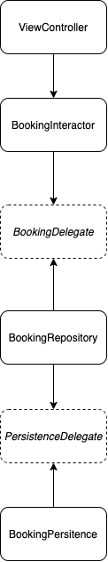

# FinanceTrial

The goal was to stay in the timebox of maximum ~ 6 hours, which is why not every topic is necessarily worked out to my personal full satisfaction. The requirements are of course fulfilled. 

## Comments on the architecture 

Since there is no previous knowledge about SwiftRx, we have not trained the participants. However, a scalable architecture using protocols was chosen. 

The following sketch illustrates the structure:

One focus is on the Dependency Inversion Principle (DIP). On the one hand, this makes the layers technologically very flexible, as it is only necessary to ensure that the interfaces are operated. On the other hand, protocols facilitate testability. In an exemplary test for the BookingInteractor, the BookingRepository was mocked in a very simple way. [Have a look here](https://github.com/kuzdu/FinanceTrial/blob/master/FinanceTrialTests/BookingInteractorTests.swift). According to this principle, each individual layer can be tested cleanly from each other. However, the test coverage is incomplete due to the timebox. 

Probably surprising: Due to the 'KISS' principle, 'CoreData' was not used. Instead, persistence was implemented using `UserDefaults` in combination with `Codable` and `JSON`. A generic mapper was implemented, which makes it easy to save and read out objects. 

## Data model
A 'user' was created, which contains 'bookings'. A `Booking` contains statements about the amount, date, income category etc. 

## Notes on the UI
The UI is kept very functional. In the 'Outlook' improvements are suggested to create a better experience. 

## Hints
- In the 'AppDelegate' are two commented out methods. One deletes all data. The other creates a lot of dummy data.
- The deletion of a booking is implemented by *Swipe-To-Delete* 
- Two functions (to be found in the `DoubleExtension` and `DateExtension`) from the code are copied from StackOverflow. The sources are indicated accordingly in the code. 
- The code was **never reviewed**: Some parts may still be debatable or can be optimized afterwards. Because of the timebox, there was no optimization towards the end. 

## Outlook
The UI offers much potential for improvement: 
- Depositing an App Icon and LaunchScreen Icon
- Display a picture and description label in the dashboard if no bookings have been stored yet 
- General add descriptive texts, what to do
- Grey out the Add/Edit button if the input data is not valid
- Extend the `User` object with a name attribute to provide better personalization
- Since the project is very small, the UI elements were created directly in the `ViewController`. In the future, a kind of UI builder should be implemented with which you can easily create corresponding elements. 

## Libraries used    
- SnapKit:  DSL for setting constraints
- R.swift: Resources are made available programmatically. This means that the paths to images and texts are always available.

## Open questions/points that have arisen during the processing
`SwiftUI` vs programmatic solution - advantages and disadvantages? 
`Combine` vs `SwiftRx`? 
`CoreData` vs. `JSON` persistence - When is what more useful?  
